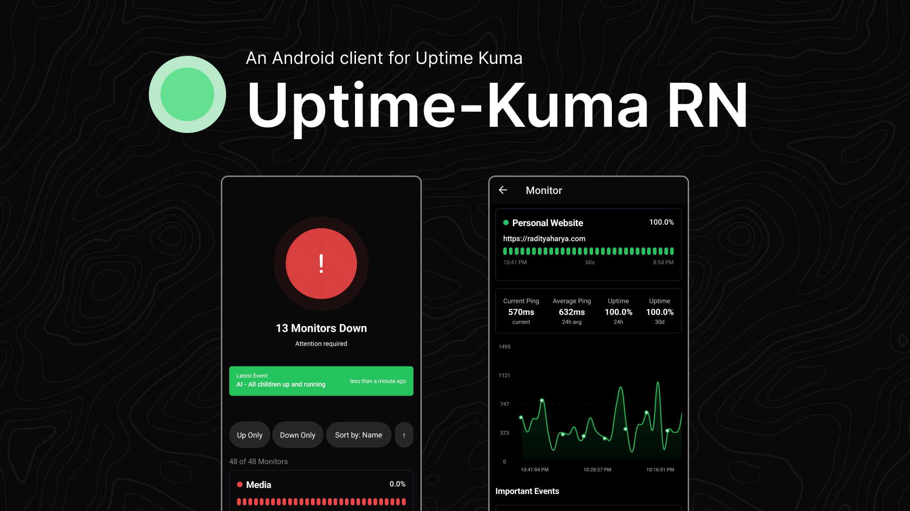

An attempt to create a mobile app for [Uptime Kuma](https://github.com/louislam/uptime-kuma) using React Native.

## Features

- [x] Monitor status overview
- [x] Monitor Detail
- [x] Real-time updates
- [x] Dark/Light theme
- [x] Status pages
- [ ] Push notifications
- [ ] Monitor management (add/edit/delete)
- [ ] Incident management
- [ ] Settings configuration
